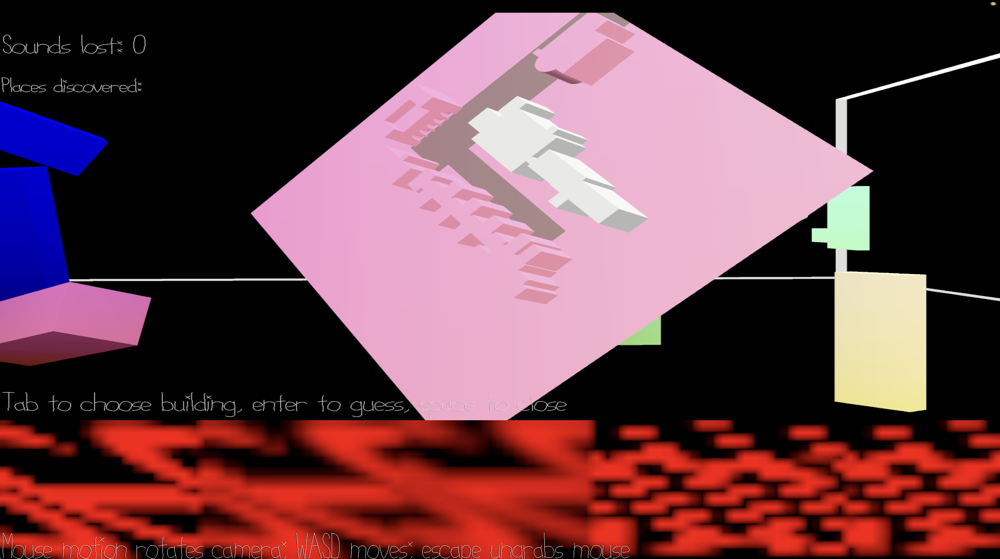

# Only a Little Bit More than Just a Screenshot

Author: Emily Amspoker

Design: I rendered my screenshot from last time, as well as the output of my `font-maker.cpp` file. I didn't get very far on this week's assignment, sorry. 

Text Drawing: The "text" (unreadable) is created by `font-maker.cpp` and output into a .png file. Then, using the code shown in class, I render a two textures: one of my screenshot from last week and some outputs of the `font-maker.cpp`.

Choices: In this "game" you have no choices and no free will, you just stare at the images I render while spooky music from last week plays in the background.

Screen Shot:

How To Play:

No goals, no strategy.

Sources: I used [Deja Vu Sans](https://dejavu-fonts.github.io/) for fonts, but you probably wouldn't be able to tell based on how the font rendered.

This game was built with [NEST](NEST.md).

